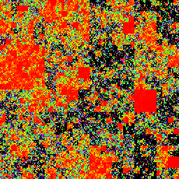

# squarezoom

Zoom in and out of a neat little random square world.

Requires [Futhark](http://futhark-lang.org) and SDL2 and SDL2-ttf
libraries with associated header files.

## Building and running

First run `futhark pkg sync` once.

## Controls

  - Mouse wheel scroll: Zoom in/out.
  - Left click and hold: Move around.
  - Right click: Automatic zoom.
  - Right click and mouse wheel scroll: Adjust automatic zoom speed.
  - `ESC`: Exit the program.
  - `F1`: Toggle the text in the upper-left corner.
  - `h`: View in the HSV color space (default).
  - `o`: View in the Oklab color space.
  - `g`: View as grayscale.
  - `r`: Generate a new world.

## `squarezoom-random`

Run `make && ./squarezoom-random/squarezoom-random -R -w 1024 -h 1024`
(or other powers of two) to build and run in a window.

## `squarezoom-image`

Run `make && ./squarezoom-image/squarezoom-image -R -w 1024 -h 1024`
(or other powers of two) to build and run in a window.

To build without the FreeImage dependency, instead run
`SQUAREZOOM_NO_FREEIMAGE=1 make`.  This means you will only be able to
read and write images in the Netpbm PAM format.  You can use
ImageMagick's `convert` utility to convert from and to this format.
